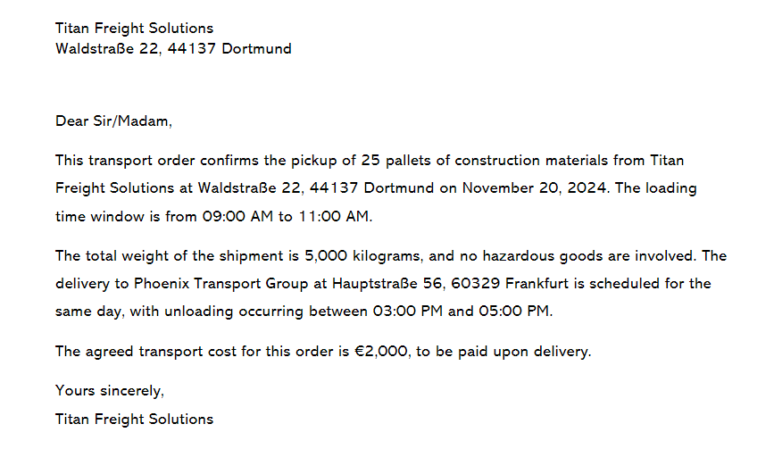
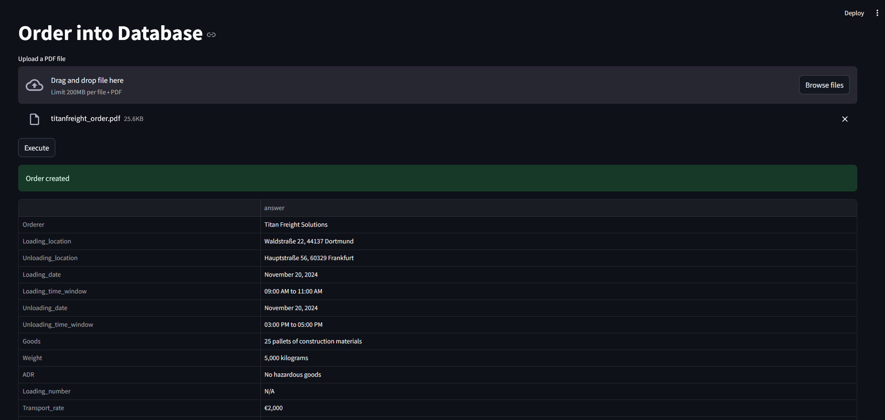
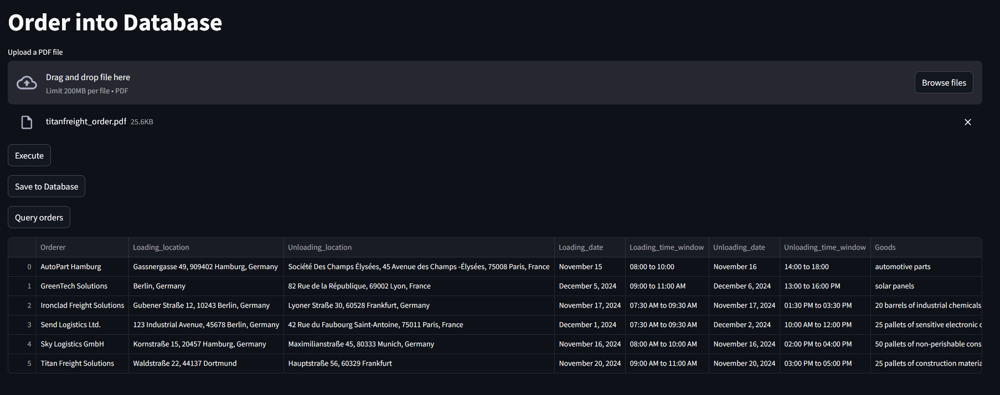

# AI Colleague For Order Entry

AI-Agent which enters incoming written orders into your SQL Database. Using RAG system for converting unstructured into structured data. Streamlit GUI and Docker

This project is about an AI automation of entering incoming order into the system. This process is often very timeconsuming and tedious. With this implementation this can be completly outsourced to an AI colleague which takes care of this. The assistant extracts all relevant data out of the order and gives a preview such that the supervisor of the assistant can check and verify if the extraction is correct. If so, he presses a button and the data gets entered/persisted into an SQL Database.  

This project is tailored for transport forwarding companies which have to deal with high emergence of incoming order on a daily basis. Automating this task to an AI Agent can save a ton of time every day. This project can be adjusted to any industry.

Project components: folder data which contains all the files the agent should have access to, the main.py file, requirements.txt file, functions.py, rag_agent.ipynb and a Dockerfile.

1. In the _main.py_ runs an streamlit app where the user can select files which will be converted into a vectorstore and consequently be processed by the agent to extract relevant data. This is previewed in a table and after confirmation added to an SQL database. This SQL table can also be queried within the app. The table has a default query which can be adjusted in the _functions.py_ file. 

2. The _functions.py_ contains all functions needed to run this project. How they work is explained detailled in the _rag_agent.ipynb_ notebook. Additionally the prompt for how the agent should work can be adjusted in this file.

3. An _.env_ saves an OPEN AI API key for the AI model used for this project (adjust it with your own API key).

4. The _requirements.txt_ file lists all packages needed for this project (run pip install -r requirements.txt). I personally recommend to create a virtual environment for this project.

5. The _rag_agent.ipynb_ notebook file gives on overview the the basic structure/framework of the foundation and how the basis of it works.

6. Finally, the _Dockerfile_ is contains all commands for setting up a Docker container (only for Windows machines).

## Getting started

To set up this repo create a folder for the project on your system (instructions for windows), open a terminal window, write "cd" and paste the folder path `cd "C:\Users\user\path\to\your\folder"`. Then type `git clone https://github.com/Yesitin/AI-Colleague-For-Order-Entry.git` to download the whole repository (ensure that you have installed python and git). 

Next, create a virtual environment in order to avoid dependency conflicts. For this, type into the terminal `python -m venv env`. With `env\Scripts\activate` you start the environment.

Now you can install all dependencies with `pip install -r requirements.txt`. 

As a last step, you have to create a .env file and insert and OpenAI key: `OPENAI_API_KEY=your_api_key`. Replace your_api_key with your actual key.

Finally, you have to enter `python -m streamlit run main.py` in your activated virtual environment terminal and the app will start. 

For setting up a docker container, you need to install Docker Desktop. Then activate in a terminal the virtual environment of the project folder and run the line `docker build -t co-worker_agent`. This will build the docker image. After this has completed run `docker run -p 8501:8501 co-worker_agent` to start the docker container. 
The Dockerfile is only for Windows machines since requirements.txt contains a package pywin32==306; platform_system == "Windows" which is only capable for Windows machines (but code of dockerfile can theoretically be adjusted). Dockerfile runs under the IP adressing 0.0.0.0, if this doesn't work i can be changed in the Dockerfile to localhost. In case please also try out to start server and then manually replace in 
browsers navigation bar (URL) `0.0.0.0` by `localhost`. For some reason, this is how it worked on my machine. 

## Use example

#### 1) This example contains the workflow of a simple order and the process of it:

#### 2) After loading the file a preview of the extracted data is displayed:

#### 3) Finally, the query of the saved sql data:

